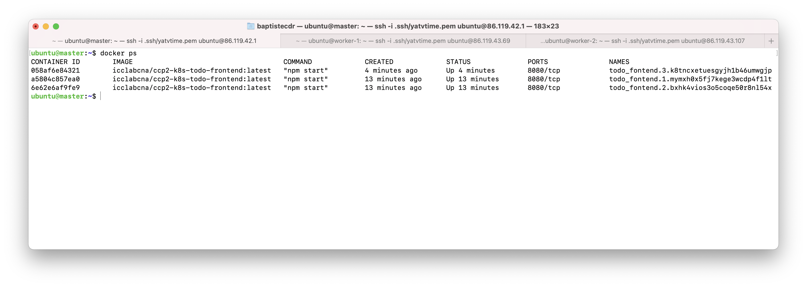
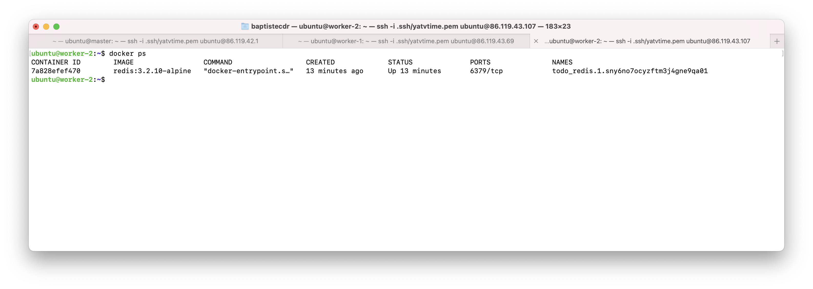
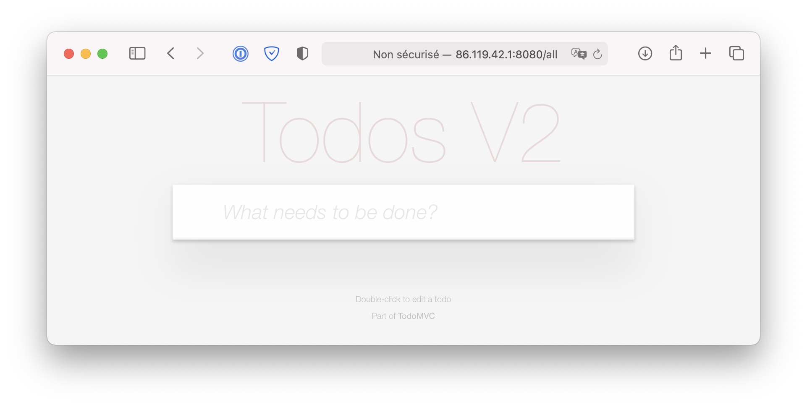

# TP - Introduction à Docker

## Configuration

* Master (Frontend)
    * IPv4 Privée : 10.0.0.78
    * IPv4 Publique : 86.119.42.1
* Worker-1 (API)
    * IPv4 Privée : 10.0.3.221
    * IPv4 Publique : 86.119.43.69
* Worker-2 (BDD)
    * IPv4 Privée : 10.0.2.199
    * IPv4 Publique : 86.119.43.107

## Déploiement

Déploiement du _frontend_ sur le nœud Master après avoir modifié le nombre de replicas sans modifier le _docker-compose_.

Déploiement de la base de données sur le nœud Worker-2.

Une fois le déploiement effectué, nous avons accès au site web via l'adresse http://86.119.42.1:8080/

## Questions
* How does Swarm deal with the loss of a replica?
    * ...
* How can you update the numbers of replicas without re-deploying with the docker-compose file?
    * We can update the number of replcias with the command `docker service scale SERVICE=REPLICA`
        * Example : `docker service scale todo_fontend=3`
* Is there a default way to auto-scale with Swarm?
    * Docker Swarn doesn't support auto-scaling out of the box.

## Auteurs

* Baptiste Coudray
* Quentin Berthet
